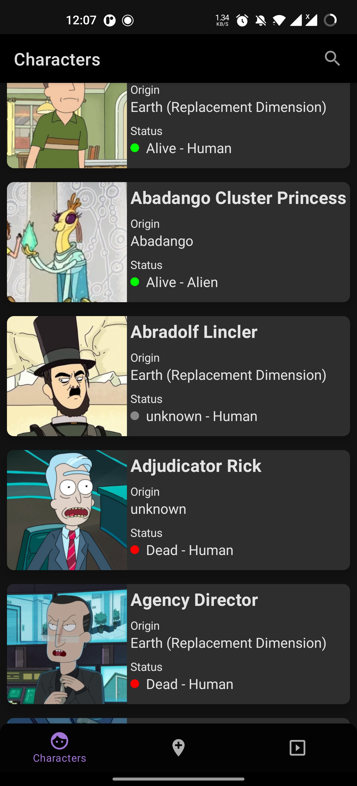
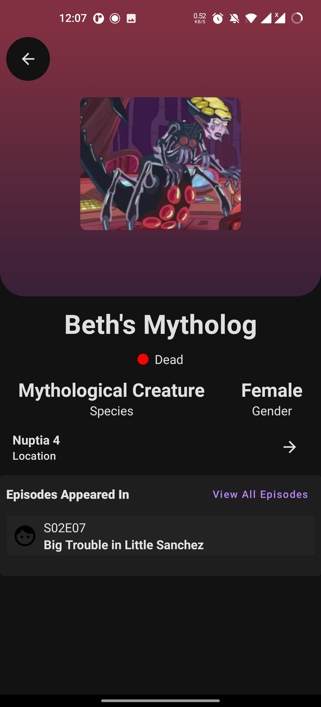

# Rick and Morty Compose

An android app built using Kotlin that consumes [Rick and Morty API](https://rickandmortyapi.com) to display characters,episodes,Location from the [TV Series](https://www.imdb.com/title/tt2861424/). It has been built following Clean Architecture Principle, Repository Pattern, MVVM Architecture in the presentation layer as well as Jetpack components(including Jetpack Compose).


## Table Of Content.

- [Prerequisite](#prerequisite)
    - [Disclaimer](##disclaimer)
- [Architecture](#architecture)
    - [What is Clean Architecture](##why-clean-architecture)
    - [Why Clean Architecture](##why-clean-architecture)
    - [Layers](##layers)
        - [Domain](###domain)
        - [Data](###data)
        - [Presentation](###presentation)
- [Tech Stack](#techstack)
    - [Libraries](##libraries)
    - [Extras](##extras)
- [Helpful Resources](#helpful-resources)
- [Demo](#demo)

## Prerequisite.

In order to be able to build the application you'll need Android Studio Minimum version Arctic Fox 20.20.3.1


## Disclaimer.
- Complex architectures like the pure clean architecture can also increase code complexity since decoupling your code also means creating lots of data transformations(mappers) and models, that may end up increasing the learning curve of your code to a point where it would be better to use a simpler architecture like MVVM.

- Clean arcitecture has only been used in this repository to help me learn Clean Architecture and it's not recommended to use clean architecture in a small scale projects such as this one

So let's get started ...

## Architecture.

### What is Clean Architecture?

A well planned architecture is extremely important for an app to scale and all architectures have one common goal- to manage complexity of your app. This isn't something to be worried about in smaller apps however it may prove very useful when working on apps with longer development lifecycle and a bigger team.

Clean architecture was proposed by [Robert C. Martin](https://en.wikipedia.org/wiki/Robert_C._Martin) in 2012 in the [Clean Code Blog](http://blog.cleancoder.com/uncle-bob/2012/08/13/the-clean-architecture.html) and it follow the SOLID principle.

<p align="center"></p>
<p align="center"></p>

The circles represent different layers of your app. Note that:

- The center circle is the most abstract, and the outer circle is the most concrete. This is called the [Abstraction Principle](https://en.wikipedia.org/wiki/Abstraction_principle_(computer_programming)). The Abstraction Principle specifies that inner circles should contain business logic, and outer circles should contain implementation details.

- Another principle of Clean Architecture is the [Dependency Inversion](https://en.wikipedia.org/wiki/Dependency_inversion_principle). This rule specifies that each circle can depend only on the nearest inward circle ie. low-level modules do not depend on high-level modules but the other way around.

### Why Clean Architecture?
- Loose coupling between the code - The code can easily be modified without affecting any or a large part of the app's codebase thus easier to scale the application later on.
- Easier to test code.
- Separation of Concern - Different modules have specific responsibilities making it easier for modification and maintenance.
### S.O.L.I.D Principles.

- [__Single Responsibility__](https://en.wikipedia.org/wiki/Single-responsibility_principle): Each software component should have only one reason to change – one responsibility.

- [__Open-Closed__](https://en.wikipedia.org/wiki/Open%E2%80%93closed_principle#:~:text=In%20object%2Doriented%20programming%2C%20the,without%20modifying%20its%20source%20code.): You should be able to extend the behavior of a component, without breaking its usage, or modifying its extensions.

- [__Liskov Substitution__](https://en.wikipedia.org/wiki/Liskov_substitution_principle): If you have a class of one type, and any subclasses of that class, you should be able to represent the base class usage with the subclass, without breaking the app.

- [__Interface Segregation__](https://en.wikipedia.org/wiki/Interface_segregation_principle): It’s better to have many smaller interfaces than a large one, to prevent the class from implementing the methods that it doesn’t need.

- [__Dependency Inversion__](https://en.wikipedia.org/wiki/Dependency_inversion_principle): Components should depend on abstractions rather than concrete implementations. Also higher level modules shouldn’t depend on lower level modules.


## Layers.

### 1. Domain.
This is the core layer of the application. The ```domain``` layer is independent of any other layers thus ] domain models and business logic can be independent from other layers.This means that changes in other layers will have no effect on domain layer eg.  screen UI (presentation layer) or changing database (data layer) will not result in any code change withing domain layer.

Components of domain layer include:
- __Models__: Defines the core structure of the data that will be used within the application.

- __Repositories__: Interfaces used by the use cases. Implemented in the data layer.

- __Use cases/Interactors__: They enclose a single action, like getting data from a database or posting to a service. They use the repositories to resolve the action they are supposed to do. They usually override the operator “invoke”, so they can be called as a function.

### 2. Data.
The ```data``` layer is responsibile for selecting the proper data source for the domain layer. It contains the implementations of the repositories declared in the domain layer. 

Components of data layer include:
- __Models__

    -__Dto Models__: Defines POJO of network responses.

    -__Entity Models__: Defines the schema of SQLite database.

- __Repositories__: Responsible for exposing data to the domain layer.

- __Mappers__: They perform data transformation between ```domain```, ```dto``` and ```entity``` models.

- __Network__: This is responsible for performing network operations eg. defining API endpoints using [Retrofit](https://square.github.io/retrofit/).

- __Cache__: This is responsible for performing caching operations using [Room](https://developer.android.com/training/data-storage/room).

- __Data Source__:  Responsible for deciding which data source (network or cache) will be used when fetching data.

### 3. Presentation.
The ```presentation``` layer contains components involved in showing information to the user. The main part of this layer are the views(activity) and viewmodels.

# Tech Stack.
This project uses many of the popular libraries, plugins and tools of the android ecosystem.

## Libraries.

- [Hilt](https://dagger.dev/hilt/) - Dependency Injection library.
- [Jetpack](https://developer.android.com/jetpack)
  
  -   [Android KTX](https://developer.android.com/kotlin/ktx.html) - Provide concise, idiomatic Kotlin to Jetpack and Android platform APIs.
  -   [Jetpack Compose](https://developer.android.com/jetpack/compose) - Jetpack Compose is Android’s modern toolkit for building native UI. It simplifies and accelerates UI development on Android.
    - [AndroidX](https://developer.android.com/jetpack/androidx) - Major improvement to the original Android [Support Library](https://developer.android.com/topic/libraries/support-library/index), which is no longer maintained.
    -   [Lifecycle](https://developer.android.com/topic/libraries/architecture/lifecycle) - Perform actions in response to a change in the lifecycle status of another component, such as activities and fragments.
    
    -   [ViewModel](https://developer.android.com/topic/libraries/architecture/viewmodel) - Designed to store and manage UI-related data in a lifecycle conscious way. The ViewModel class allows data to survive configuration changes such as screen rotations.
    
    - [Room](https://developer.android.com/training/data-storage/room) - Provides an abstraction layer over SQLite used for offline data caching.
    - [Navigation Component](https://developer.android.com/guide/navigation/navigation-getting-started) -Component that allows easier implementation of navigation from simple button clicks to more complex patterns.


- [Retrofit](https://square.github.io/retrofit/) - Type-safe http client 
and supports coroutines out of the box.  

- [OkHttp-Logging-Interceptor](https://github.com/square/okhttp/blob/master/okhttp-logging-interceptor/README.md) - Logs HTTP request and response data.
- [Coroutines](https://github.com/Kotlin/kotlinx.coroutines) - Library Support for coroutines.
- [Flow](https://developer.android.com/kotlin/flow) - Flows are built on top of coroutines and can provide multiple values. A flow is conceptually a stream of data that can be computed asynchronously.
- [Square/Logcat](https://github.com/square/logcat)-Library for easier logging.
- [Material Design](https://material.io/develop/android/docs/getting-started/) - Build awesome beautiful UIs.
- [LandScapist](https://github.com/skydoves/Landscapist) - Jetpack Compose image loading library which fetches and displays network images with Glide, Coil, and Fresco.
- [kotlinx.coroutines](https://github.com/Kotlin/kotlinx.coroutines) - Library Support for coroutines,provides runBlocking coroutine builder used in tests.

- [Compose-Accompanist](https://google.github.io/accompanist/) -Accompanist is a group of libraries that aim to supplement Jetpack Compose with features that are commonly required by developers but not yet available.
  -  [Navigation Animation](https://google.github.io/accompanist/navigation-animation/) A library which provides Compose Animation support for Jetpack Navigation Compose.
  -  [System UI Controller ](https://google.github.io/accompanist/systemuicontroller/) System UI Controller provides easy-to-use utilities for updating the System UI bar colors within Jetpack Compose.


# Helpful Resources
In this section i've included some resources ie. articles and GitHub repositories that are helpful when learning about clean architecture:

1. [The clean code blog](https://blog.cleancoder.com/uncle-bob/2012/08/13/the-clean-architecture.html) by Robert C. Martin.
2. [A detailed guide on developing android apps using clean architecture pattern](https://medium.com/@dmilicic/a-detailed-guide-on-developing-android-apps-using-the-clean-architecture-pattern-d38d71e94029) Medium article.
3. [Clean Architecture Component Boilerplater](https://github.com/bufferapp/clean-architecture-components-boilerplate) GitHub repo .
4. [Gamex Compose](https://github.com/VictorKabata/Gamex-Compose) GitHub repo by [Victor Kabata](https://github.com/VictorKabata) demonstrating using clean architecture pattern  
5. [Clean architecture sample](https://www.youtube.com/watch?v=Mr8YKDh3li4) Video by Philip Lackner
6. [Foodies](https://github.com/LinusMuema/foodies/) Github Repo by [Linus Moose](https://github.com/LinusMuema) to show how to build UIs with Compose
7. [Pokedex](https://github.com/ronnieotieno/PokeApi-Pokedex) by [Ronnie Otieno](https://github.com/ronnieotieno) demonstrating how to properly use Jetpack Components


## Demo
These are the app's screenshots and video:


  

  


https://user-images.githubusercontent.com/17760799/152233385-3e76f6a4-6a96-429c-acb7-2eb7cd842bae.mp4


